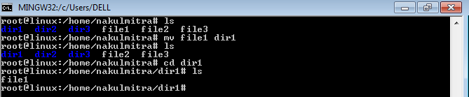

# Basic Linux Operations
This repository inclues basic linux oprations such as 
1. Create file, directory, user, group
2. Delete file and directory
3. Copy, cut & paste and rename a file
4. Change directory
5. Commands like ls, sort, stat, pwd
6. How to create hardlink and softlink
7. Compress and De-compress operations

# Making Files 

# 1.Using cat command
1.1 Making Empty File

1.2 See  the content of a file

1.3 Add content to the file

1.4 Combine the content of two files into third file

# 2.Using touch command
2.1 Making Empty File

2.2 Making multiple empty files

2.3 Making hidden files
Only need to add . before file_name

# 3.Using  vi command
Step 1: vi fileName, new editor will be open

Step 2: Press i button to write

Step 3: Enter your content

Step 4: Press esc button

Step 5: Write :wq

# Making Directories
1. Making single directory

2. Making multiple directories

3. Making parent directory

# Change directory
1. To go into the directory

2. To come out from the directory

# Delete file and directory
1. Delete a file

2. Delete directory 

3. Delete directory using rm command

# Copy a file
cp sourcFile destinationFile

# Cut and paste a file
mv sourceFileName destinationDirectory

# Rename a file
mv oldFileName newFileName

# Some other operations

# pwd command
Print working directory

# sort the content of a file

# ls command

1. ls 
To see files and directories present in a current location

2. ls -a

To see hidden files and directories as well

3. To see meta data of files and directories

# stat command
To see access, modified and change time of a file

# Create user

# Create group

# Create hardlink for a file
Hardlink is used to create backup of a file

# Create softlink for a file
Softlink is used as a shortcut

# How to compress a file

# How to decompress a file

Note: Linux is case sensitive. 

 
